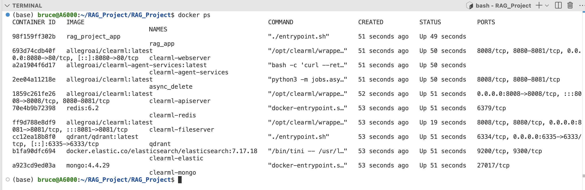

## The hierarchical structure of the Docker containers

```plaintext
ClearML Docker Compose
├── apiserver
│   ├── redis
│   ├── mongo
│   ├── elasticsearch
│   └── fileserver
├── webserver
│   └── apiserver
├── async_delete
│   ├── apiserver
│   ├── redis
│   ├── mongo
│   ├── elasticsearch
│   └── fileserver
├── agent-services
│   ├── apiserver
│   └── volumes
├── fileserver
├── elasticsearch
├── redis
├── mongo
└── ClearML Frontend Agent
```


## Service Breakdown

### 1. `apiserver`
- **Description:** The core service handling communication between other ClearML services.
- **Dependencies:** `redis`, `mongo`, `elasticsearch`, and `fileserver`.

---

### 2. `webserver`
- **Description:** Provides the web-based UI for interacting with ClearML.
- **Dependencies:** `apiserver`.

---

### 3. `async_delete`
- **Description:** Handles URL deletion asynchronously.
- **Dependencies:** `redis`, `mongo`, `elasticsearch`, and `fileserver`.

---

### 4. `agent-services`
- **Description:** Manages ClearML agents responsible for distributed computation tasks.
- **Dependencies:** `apiserver`.

---

### 5. `fileserver`
- **Description:** Handles file storage for ClearML’s operations.

---

### 6. `elasticsearch`
- **Description:** Handles indexing and search capabilities.

---

### 7. `redis`
- **Description:** Message queue and caching service.

---

### 8. `mongo`
- **Description:** Database backend for ClearML services.

---

## 9. `ClearML Frontend Agent`
- **Description:** Handles agent worker tasks and dependencies.
